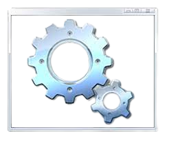
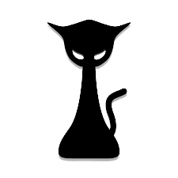
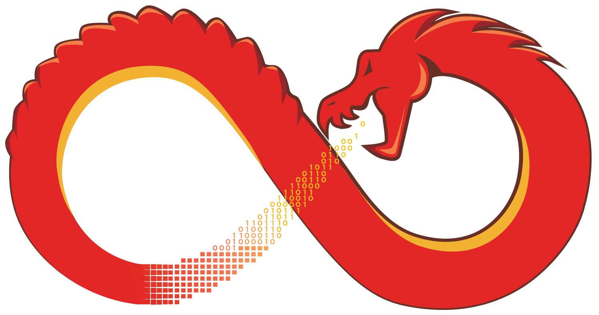

 
<h1 align="center"><b>Welcome to Vyankatesh Pipalwa's profile! </b></h1>
 

  

## <picture></picture> **About me**
<picture> </picture>

- 👋 Hi, I’m [F745H](https://github.com/F745H/)
- 👀 I’m a Computer Geek.
- 🌱 I’m currently learning with Google and ChatGPT.
- 💞️ I’m looking to collaborate with cybersecurity python projects.
- 💬 Ask me about Linux, Networking, Scripting and Cybersecurity.
- 📫 How to reach me .. By my LinkedIn [Profile](https://www.linkedin.com/in/vyankatesh-pipalwa).
- Every day, I am dedicated to enhance my skills by learning new technologies to become 1% better than past my self.
___

  

## :triangular_flag_on_post: CTF Profiles:

 
 

 

> Progamming languages

<table>
  <tr>
    <td align="center" width="96">
      
       Python
    </td>
    <td align="center" width="96">
      
       SQL
    </td>
    <td align="center" width="96">
      
       C
    </td>
    <td align="center" width="96">
      
       C++
     <td align="center" width="96">
      
       HTML
    </td>
    <td align="center" width="96">
      
       Bash
    </td>
    <td align="center" width="96">
      
       Powershell
    </td>
    <td align="center" width="96">
      
       Batch
    </td>
    </tr>
</table>

> Frameworks and libraries

<table>
  <tr>
    <td align="center" width="96">
      
       Arduino
    </td>
    <td align="center" width="96">
      
       GitHub-Action
    </td>
     <td align="center" width="96">
      
       Wordpress
    </td>
    </tr>
</table>

> Databases and cloud hosting

<table>
  <tr>
    <td align="center" width="96">
      
       GitHub Page
    </td>
    <td align="center" width="96">
      
       my-sql
    </td>
    </tr>
</table>

> operating system

<table>
  <tr>
    <td align="center" width="96">
      
       kali
    </td>
    <td align="center" width="96">
      
       Windows
    </td>
    <td align="center" width="96">
      
       Linux Mint
    </td>
    <td align="center" width="96">
      
       Raspberry pi
    </td>
    <td align="center" width="96">
      
       Ret-Hat
    </td>
    <td align="center" width="96">
      
       Debian
    </td>
    <td align="center" width="96">
      
       ARCH
    </td>
    <td align="center" width="96">
      
       android
    </td>
    <td align="center" width="96">
      
       Chrome OS
    </td>
    </tr>
</table>

> Software and tools

<table>
  <tr>
    <td align="center" width="96">
      
       nmap
    </td>
    <td align="center" width="96">
      
       BurpSuite
    </td>
    <td align="center" width="96">
      
       Hashcat
    </td>
    <td align="center" width="96">
      
       John The Ripper
    </td>
    <td align="center" width="96">
      
       Git
    </td>
     <td align="center" width="96">
      
       Hydra
    </td>
   <td align="center" width="96">
      
       Metasploit
    </td>
    <td align="center" width="96">
      
       wireshark
    </td>
    <td align="center" width="96">
      
       Ghidra
    </td>
    <td align="center" width="96">
      
       Visual Studio
    </td>
     <tr>
    <td align="center" width="96">
      
       Sublime
    </td>
    </tr>
</table>

## 📊 GitHub Stats:

 

 

 

## 🔝 Top Contributed Repo

 

## 🌐 Socials:
 

 

